# 我用n8n+AI搭了个「Reddit商业机会挖掘系统」，自动发现商业痛点并生成解决方案，24小时不间断运行

## 痛点共鸣
如果你是创业者，最大的难题往往是找不到真正的市场痛点
而如果你是产品经理，需要持续发现用户需求和商业机会
这些困境，都源于信息获取效率低下和分析能力不足

## 解决方案预告
今天，仁戈就手把手带你用n8n+AI，从0到1搭建Reddit商业机会挖掘系统

## 理论框架
### 传统方式的问题痛点
1. 手动浏览Reddit效率低下，无法覆盖所有相关内容
2. 人工分析商业价值主观性强，容易遗漏机会
3. 无法24小时持续监控，错失时效性机会
痛点总结：效率低、主观性强、时效性差

### 工作流解决方案
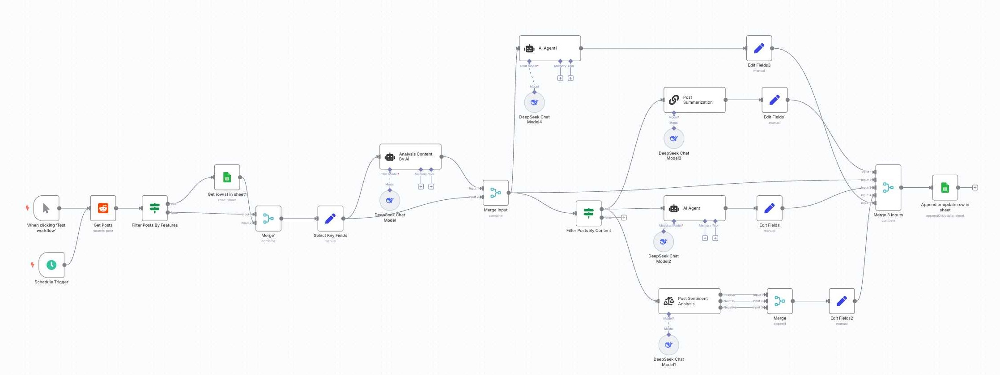

1. **自动获取** - Reddit API获取商业相关帖子
2. **智能过滤** - AI分析筛选真正的商业问题
3. **深度分析** - 多维度AI分析生成商业洞察
4. **结果存储** - 自动保存到Google Sheets便于管理

## 详细教程

### 阶段一：数据获取与初步过滤
- 目标：从Reddit获取高质量的商业相关帖子
- 节点：触发器、Reddit API、特征过滤、去重检查
- 配置：设置搜索参数和过滤条件
- 效果：获得符合基本条件的帖子列表

#### 1.1 设置触发器
**Manual Trigger节点配置：**
- 节点类型：`n8n-nodes-base.manualTrigger`
- 用途：手动测试工作流
- 配置参数：无需特殊配置

**Schedule Trigger节点配置：**
- 节点类型：`n8n-nodes-base.scheduleTrigger`
- 用途：定时自动执行工作流
- 配置参数：
  - 执行间隔：可设置为每小时、每天等
  - 建议设置为每6小时执行一次

#### 1.2 Reddit API获取帖子
**Get Posts节点配置：**
- 节点类型：`n8n-nodes-base.reddit`
- 操作：`search`
- 详细配置：
  - **Subreddit**: `smallbusiness`
  - **Keyword**: `looking for a solution`
  - **Limit**: `10`
  - **Sort**: `hot`
- 认证：需要配置Reddit OAuth2 API凭据

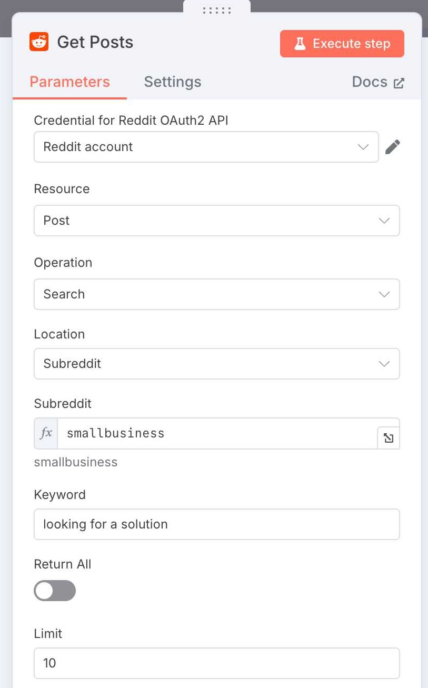

#### 1.3 按特征过滤帖子
**Filter Posts By Features节点配置：**
- 节点类型：`n8n-nodes-base.if`
- 过滤条件（AND逻辑）：
  1. **点赞数过滤**: `{{ $json.ups }} > 2`
  2. **内容非空**: `{{ $json.selftext }}` 不为空
  3. **时间过滤**: `{{ DateTime.fromSeconds($json.created).toISO() }}` 在过去180天内

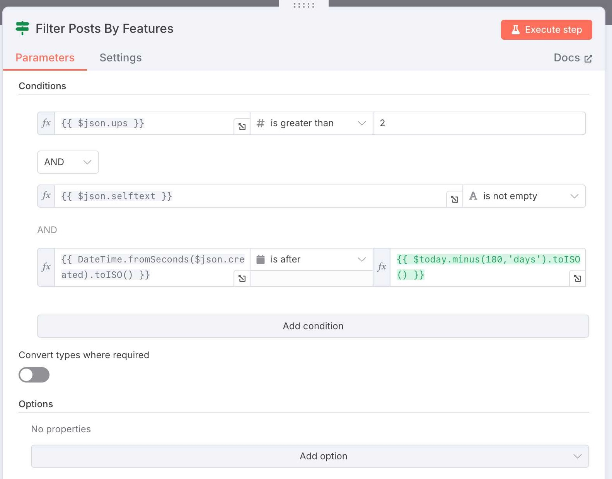

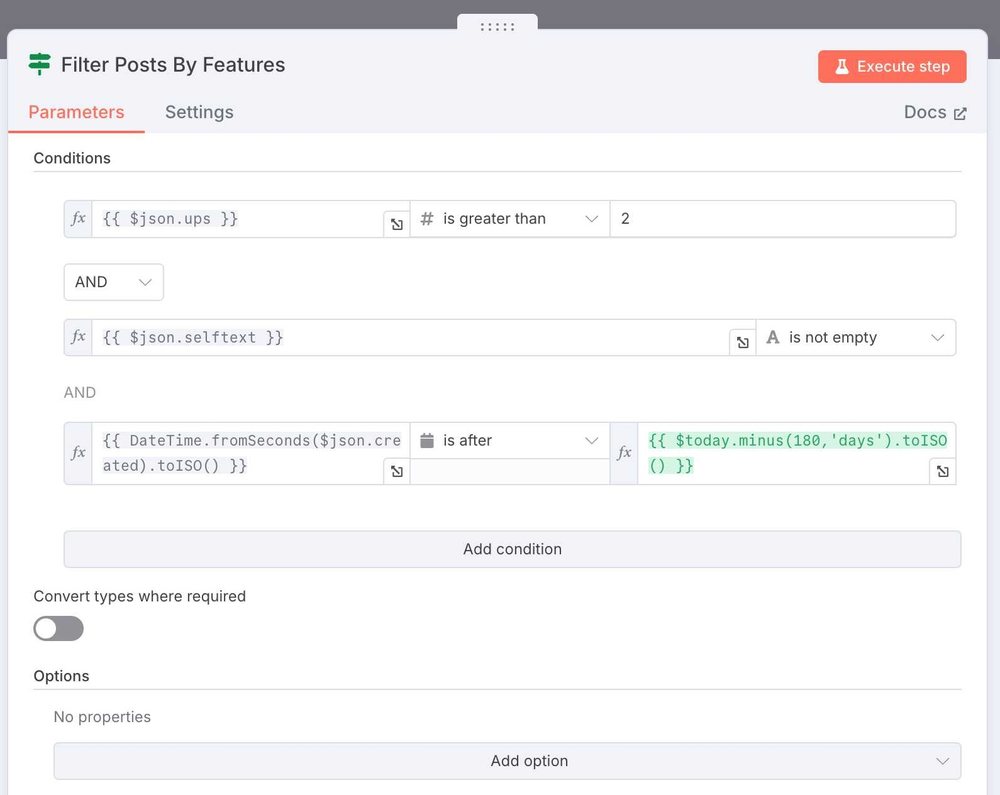

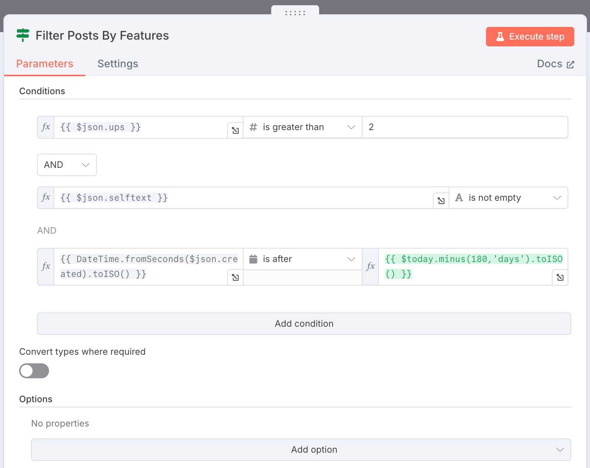

#### 1.4 Google Sheets去重检查
**Get row(s) in sheet1节点配置：**
- 节点类型：`n8n-nodes-base.googleSheets`
- 操作：查询现有记录
- 配置参数：
  - **Document ID**: `1NoJFHSlvmyygvzcVLH6T4sPTTcXjCefDpdiBdo2Ytks`
  - **Sheet Name**: `工作表1`
  - **Filter**: `Post_url = {{ $json.url }}`

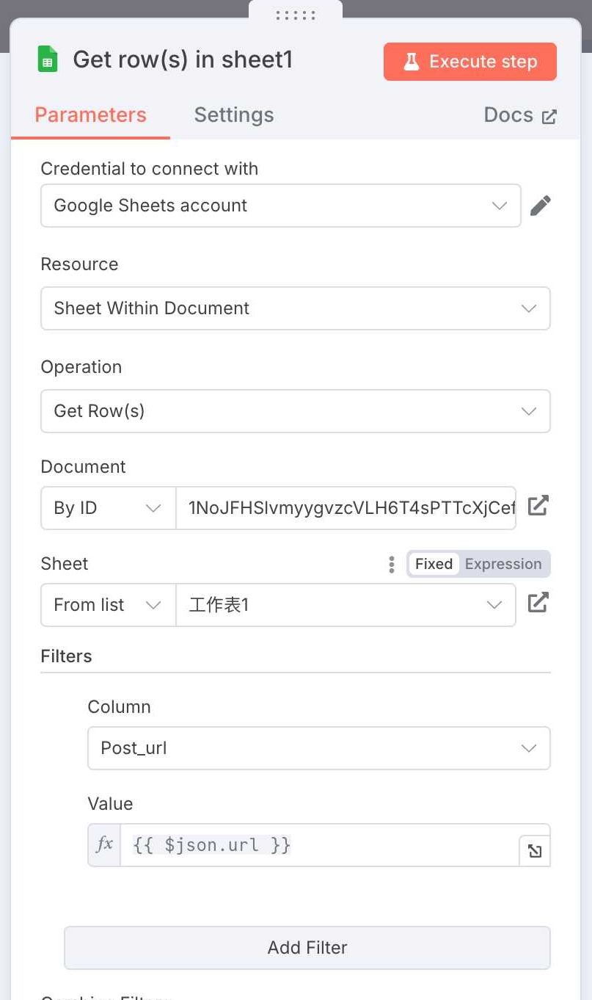

#### 1.5 数据合并去重
**Merge1节点配置：**
- 节点类型：`n8n-nodes-base.merge`
- 合并模式：`combine`
- 高级设置：
  - **Merge By Fields**: `url` 对应 `Post_url`
  - **Join Mode**: `keepNonMatches`（保留不匹配的记录）
  - **Output Data From**: `input1`

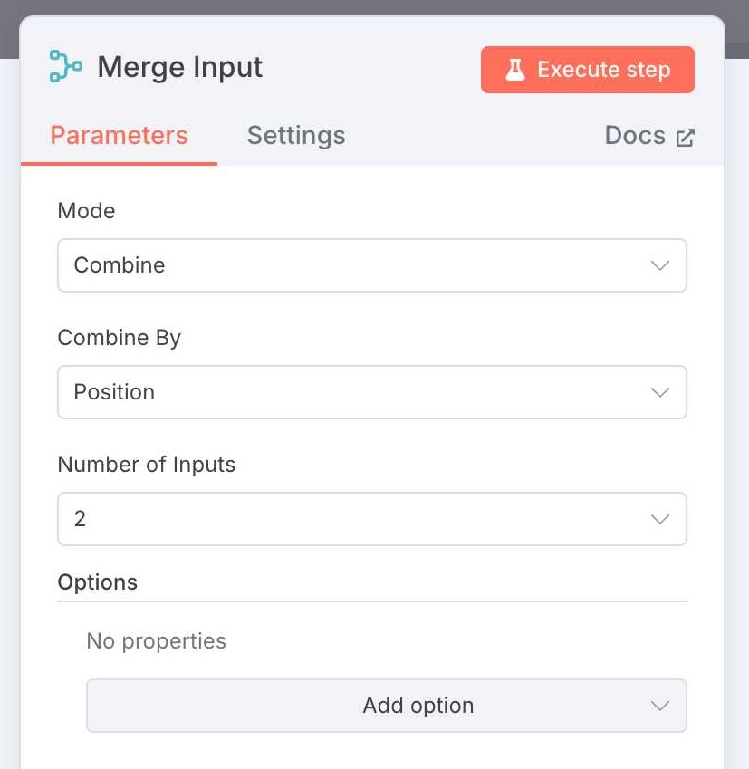

### 阶段二：数据预处理
- 目标：提取关键字段并进行AI内容分析
- 节点：字段选择、AI分析、数据合并
- 配置：设置字段映射和AI提示词
- 效果：获得结构化数据和AI分析结果

#### 2.1 选择关键字段
**Select Key Fields节点配置：**
- 节点类型：`n8n-nodes-base.set`
- 字段映射：
  - `upvotes`: `{{ $json.ups }}`
  - `subreddit_subscribers`: `{{ $json.subreddit_subscribers }}`
  - `postcontent`: `{{ $json.selftext }}`
  - `url`: `{{ $json.url }}`
  - `date`: `{{ DateTime.fromSeconds($json.created).toISO() }}`
  - `title`: `{{ $json.title }}`

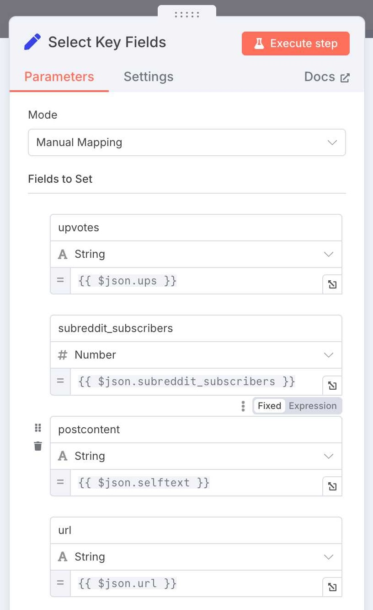

#### 2.2 AI内容分析
**Analysis Content By AI节点配置：**
- 节点类型：`@n8n/n8n-nodes-langchain.agent`
- Agent类型：`conversationalAgent`
- 提示词类型：`define`
- **提示词内容**：
```
Decide whether this reddit post is describing a business-related problem or a need for a solution. The post should mention a specific challenge or requirement that a business is trying to address.
Reddit post: {{ $json.postcontent }}
Is this post about a business problem or need for a solution ? Output only yes or no
```

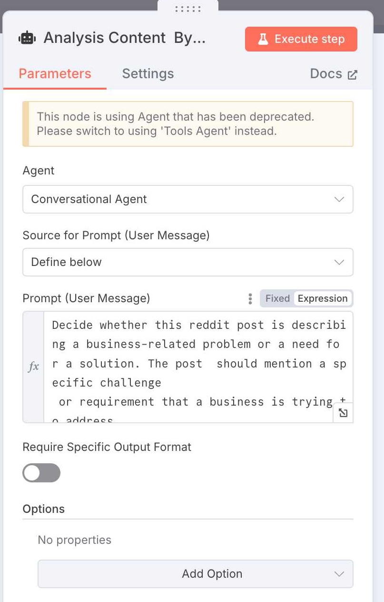

**DeepSeek Chat Model配置：**
- 节点类型：`@n8n/n8n-nodes-langchain.lmChatDeepSeek`
- 认证：需要配置DeepSeek API凭据
- 连接：作为AI Agent的语言模型

#### 2.3 合并输入数据
**Merge Input节点配置：**
- 节点类型：`n8n-nodes-base.merge`
- 合并模式：`combine`
- 合并方式：`combineByPosition`
- 输入：AI分析结果 + 原始数据


### 阶段三：内容过滤与AI分析
- 目标：对通过AI筛选的内容进行深度分析
- 节点：内容过滤、总结、情感分析、商业创意生成、翻译
- 配置：设置多个AI分析任务的提示词
- 效果：获得全面的AI分析结果

#### 3.1 按内容过滤
**Filter Posts By Content节点配置：**
- 节点类型：`n8n-nodes-base.if`
- 过滤条件：`{{ $json.output }} = "yes"`
- 用途：只处理AI判断为商业问题的帖子

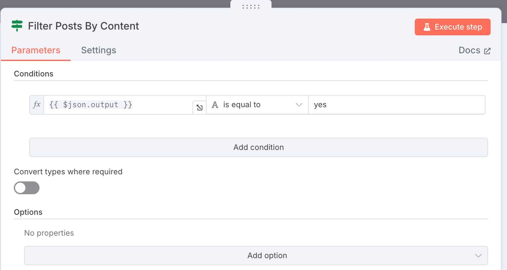

#### 3.2 帖子总结
**Post Summarization节点配置：**
- 节点类型：`@n8n/n8n-nodes-langchain.chainSummarization`
- 总结方法：使用自定义提示词
- **提示词配置**：
  - **Combine Map Prompt**: `Write a concise summary of the following，输出中文:\n\n\n"{text}"\n\n\nCONCISE SUMMARY:`
  - **Prompt**: `Write a concise summary of the following，输出中文:\n\n\n"{text}"\n\n\nCONCISE SUMMARY:`

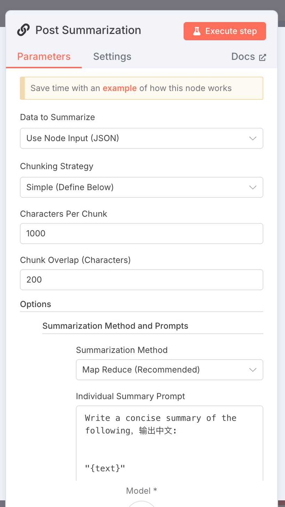

#### 3.3 情感分析
**Post Sentiment Analysis节点配置：**
- 节点类型：`@n8n/n8n-nodes-langchain.sentimentAnalysis`
- 输入文本：`{{ $json.postcontent }}`
- 语言模型：连接DeepSeek Chat Model1

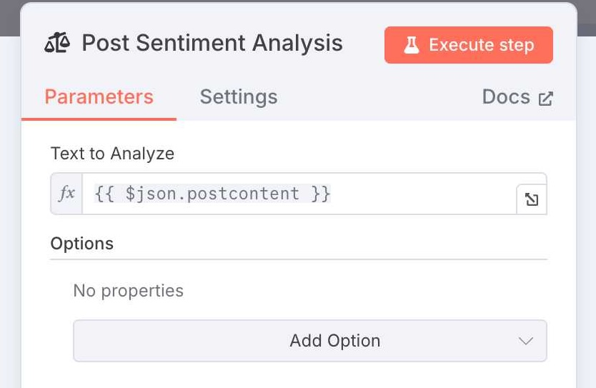

#### 3.4 商业创意生成
**AI Agent节点配置：**
- 节点类型：`@n8n/n8n-nodes-langchain.agent`
- 提示词类型：`define`
- **提示词内容**：
```
基于以下 Reddit 帖子，请提出一个商业创意或服务，我可以用它来帮助解决这个问题，并为其他有类似需求的业务提供帮助。

Reddit 帖子： "{{ $json.postcontent }}"

请提供一个简洁的商业创意或服务描述，该创意或服务能够有效解决多个面临类似挑战的业务所面临的问题，输出中文。
```

<!--  -->

#### 3.5 标题翻译
**AI Agent1节点配置：**
- 节点类型：`@n8n/n8n-nodes-langchain.agent`
- 提示词类型：`define`
- **提示词内容**：`翻译这个内容，翻译成中文： {{ $json.title }}`

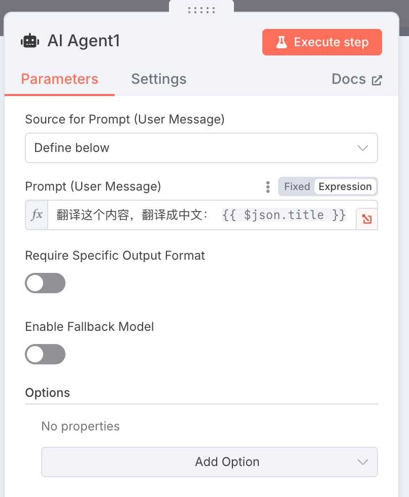

### 阶段四：数据整合与输出
- 目标：整合所有AI分析结果并保存到Google Sheets
- 节点：字段编辑、数据合并、Google Sheets写入
- 配置：设置字段映射和表格结构
- 效果：完整的商业机会分析报告自动保存

#### 4.1 字段编辑
**Edit Fields节点配置：**
- 节点类型：`n8n-nodes-base.set`
- 字段映射：`idea`: `{{ $json.output }}`

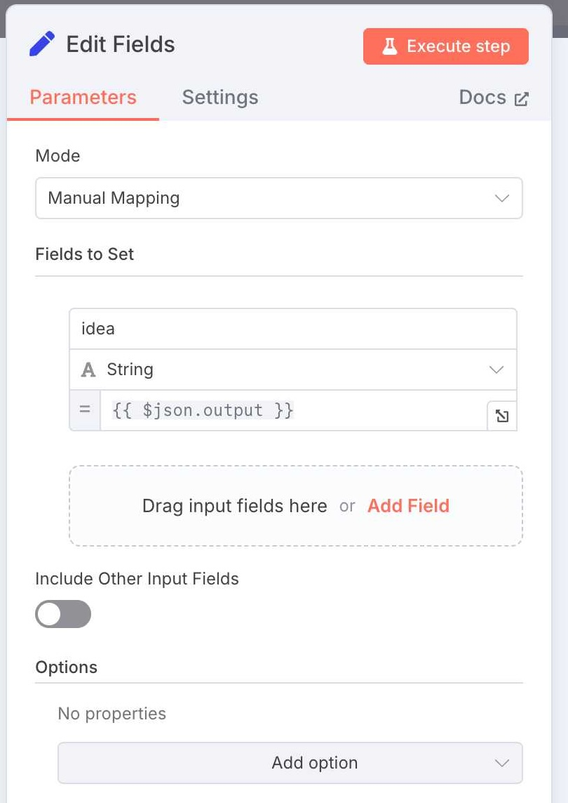

**Edit Fields1节点配置：**
- 字段映射：`summary`: `{{ $json.response.text }}`

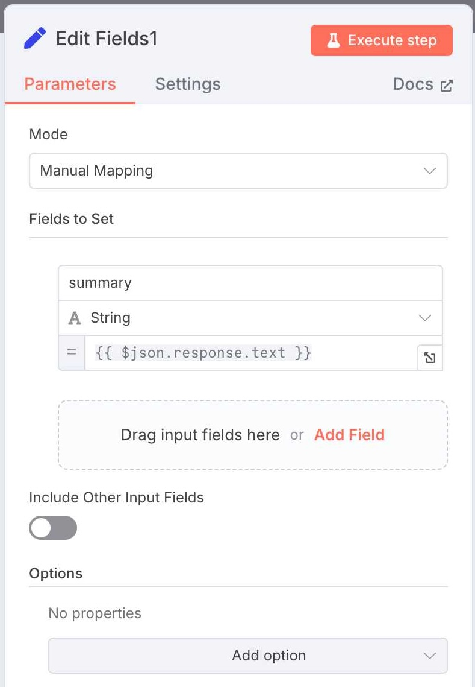

**Edit Fields2节点配置：**
- 字段映射：`sentiment`: `{{ $json.sentimentAnalysis.category }}`

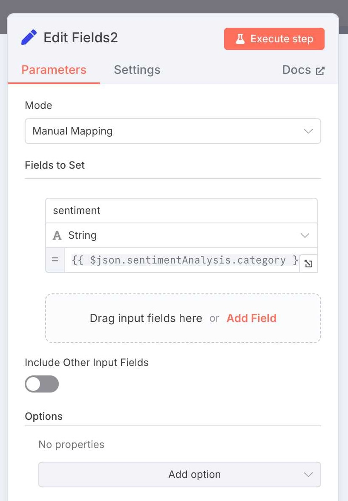

**Edit Fields3节点配置：**
- 字段映射：`title_chinese`: `{{ $json.output }}`

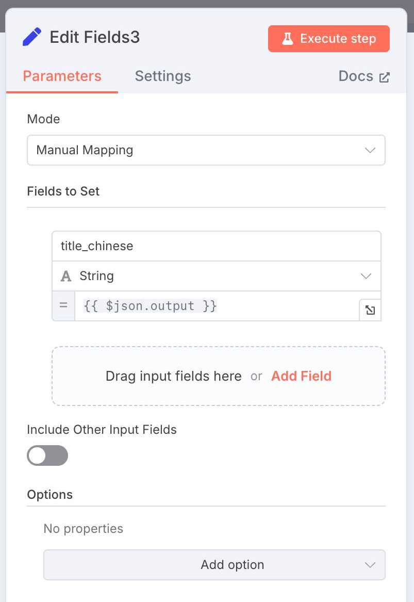

<!--  -->

#### 4.2 最终数据合并
**Merge 3 Inputs节点配置：**
- 节点类型：`n8n-nodes-base.merge`
- 输入数量：5个
- 合并模式：`combine`
- 合并方式：`combineByPosition`

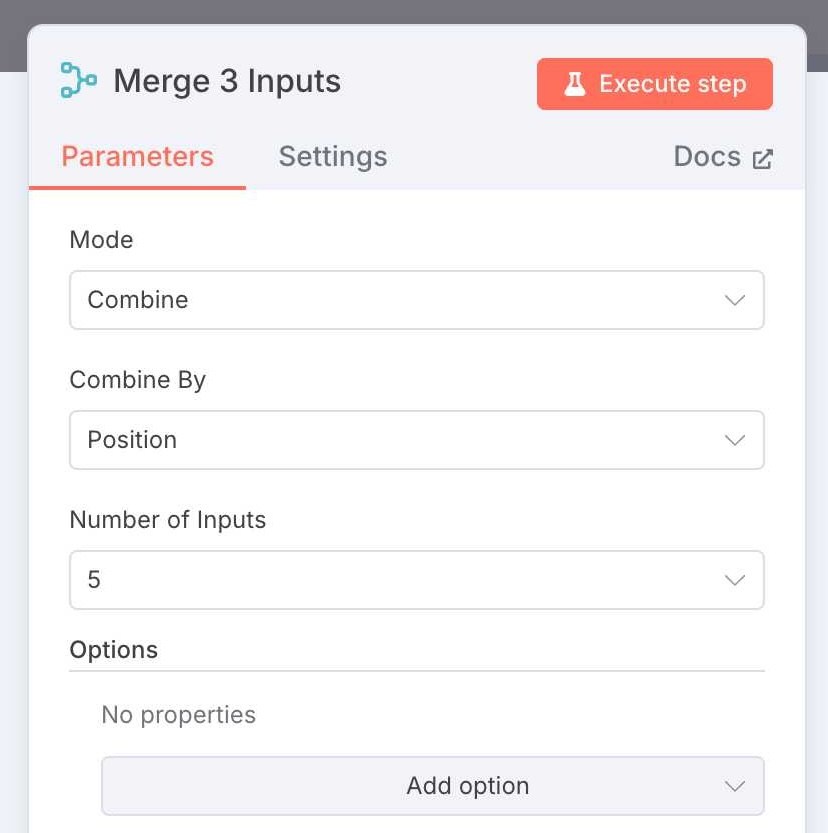

#### 4.3 保存到Google Sheets
**Append or update row in sheet节点配置：**
- 节点类型：`n8n-nodes-base.googleSheets`
- 操作：`appendOrUpdate`
- **表格配置**：
  - **Document ID**: `1NoJFHSlvmyygvzcVLH6T4sPTTcXjCefDpdiBdo2Ytks`
  - **Sheet Name**: `工作表1`
  - **Matching Columns**: `Post_url`（用于去重）

**列映射配置**：
- `Post_summary`: `{{ $json.summary }}`
- `Post_solution`: `{{ $json.idea }}`
- `Sentiment`: `{{ $json.sentiment }}`
- `Post_url`: `{{ $json.url }}`
- `Upvotes`: `{{ $json.upvotes }}`
- `Subreddit_size`: `{{ $json.subreddit_subscribers }}`
- `Post_date`: `{{ $json.date }}`
- `Title`: `{{ $json.title }}`
- `Is_Bussiness`: `{{ $json.output }}`
- `Title_chinese`: `{{ $('Edit Fields3').first().json.title_chinese }}`

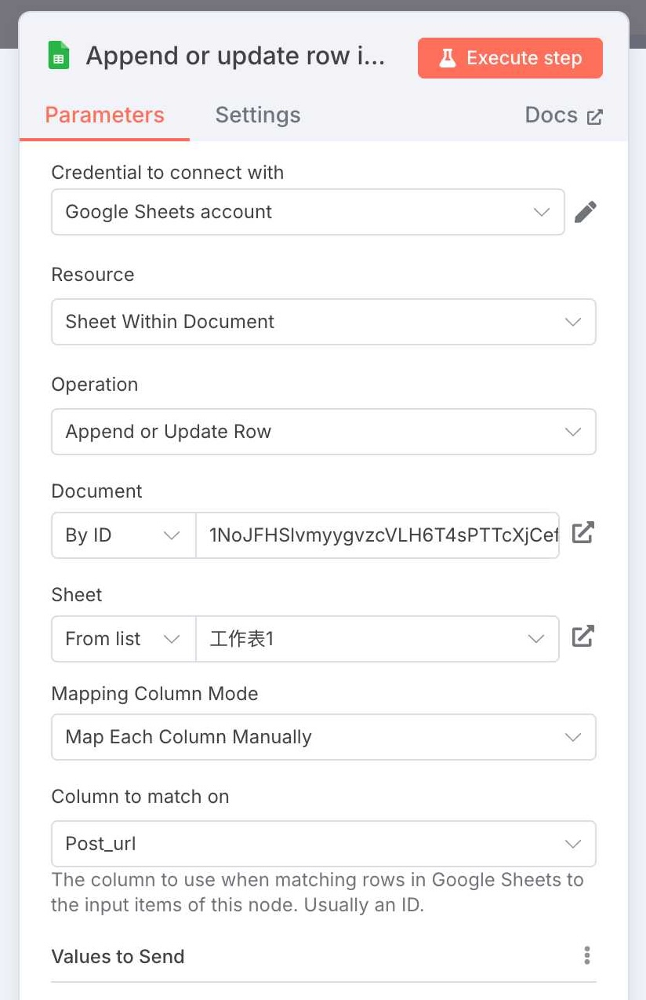

---

我是仁戈，关注我，一起成长。

如果你觉得这篇文章对你有帮助，别忘了点赞+收藏+转发哦～
