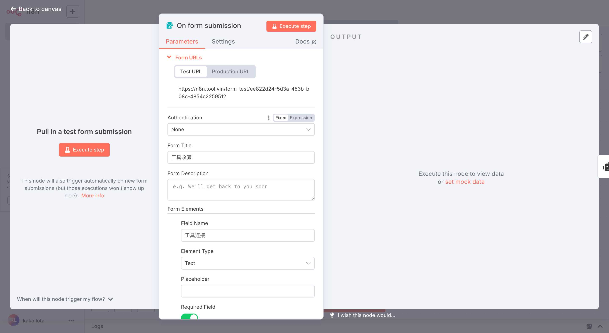
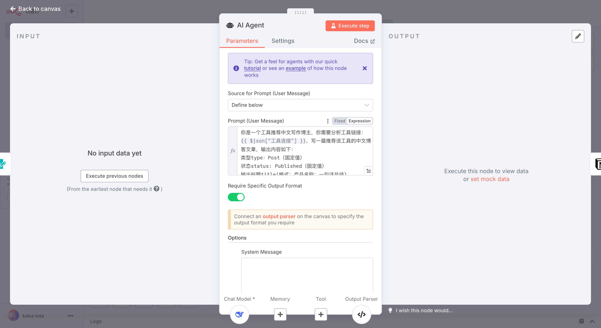
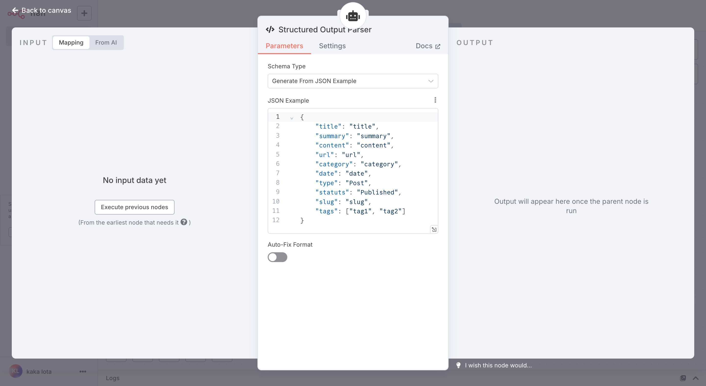
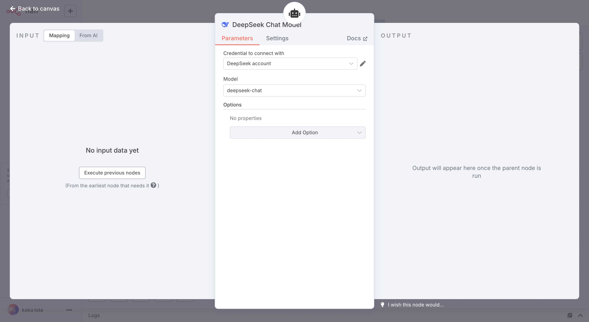
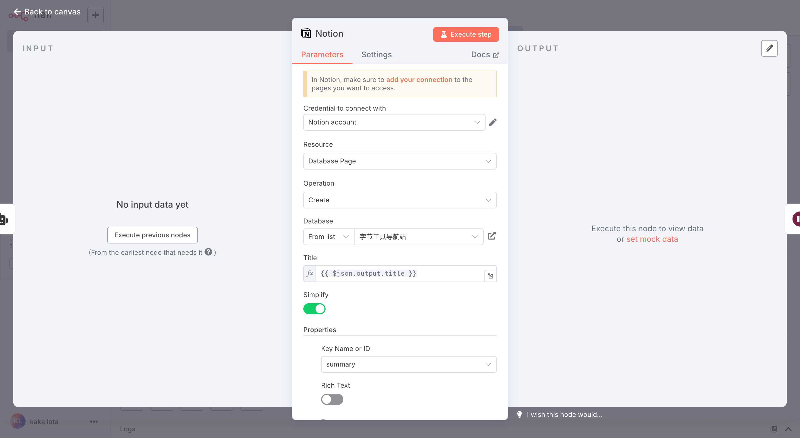
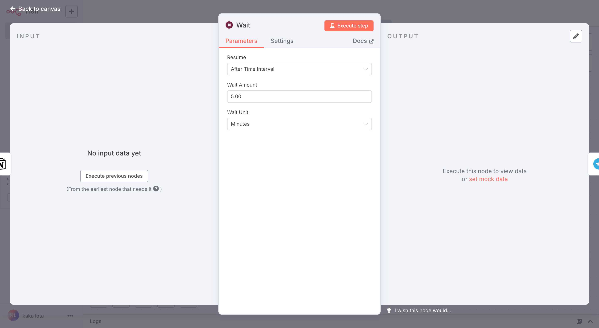
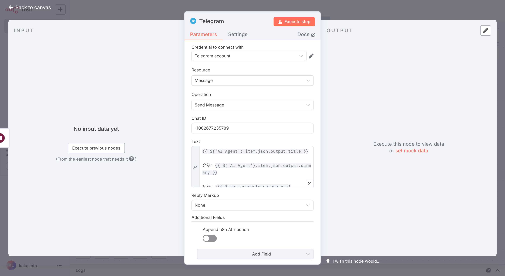

# 我用n8n搭了个「工具收藏家」，自动化收集、分析、归档和分发，每天定时推送

## 痛点共鸣
如果你是内容创作者，最大的难题往往是持续不断地寻找新鲜、有趣的工具来丰富你的内容。
而如果你是产品经理或开发者，需要时刻保持对行业内新工具的敏感度，以便在工作中选择最合适的解决方案。
这些困境，都源于信息过载和缺乏高效的工具管理流程。

## 解决方案预告
今天，仁戈就手把手带你用 n8n，从0到1搭建一个属于你自己的「工具收藏家」自动化工作流。

## 理论框架
### 传统方式的问题
1. **手动收藏，效率低下**: 看到好工具，手动保存到收藏夹或笔记应用，耗时耗力，且容易忘记。
2. **信息孤岛，难以利用**: 收藏的工具信息散落在各处，无法形成统一的知识库，难以检索和利用。
3. **缺乏提醒，容易遗忘**: 收藏的工具越来越多，但很少会主动回顾和使用，最终沦为“数字垃圾”。
痛点总结：**耗时、分散、易忘**

### AI工作流解决方案
通过 n8n 搭建的 AI 工作流，我们可以实现以下四步自动化：
1. **自动捕获**: 通过表单轻松提交工具链接。 
2. **智能分析**: AI 自动分析工具信息，生成摘要、标签等。
3. **有序归档**: 将处理好的工具信息自动存入 Notion 数据库。
4. **即时推送**: 将新收藏的工具信息通过 Telegram 推送，方便随时查看。

## 详细教程
### 阶段一：表单触发，捕获工具链接
- **目标**：创建一个表单，用于提交新的工具链接。
- **节点**：On form submission
- **配置**：
  - **Form Title**: 工具收藏
  - **Form Fields**:
    - **Field Label**: 工具连接 (必填)
- **效果**：通过表单提交一个工具链接，触发工作流。
- **截图**：


### 阶段二：AI分析，提取关键信息
- **目标**：使用 AI 分析工具链接，提取标题、摘要、标签等信息。
- **节点**：AI Agent
- **配置**：
  - **Prompt**: 
  ```
  你是一个工具推荐中文写作博主，你需要分析工具链接：{{ $json["工具连接"] }}，写一篇推荐该工具的中文博客文章，输出内容如下：
  类型type：Post（固定值）
  状态status: Published（固定值）
  输出标题title(格式：产品名称：一句话总结)，
  摘要summary，
  内容connent，
  日期date：{{$today}}，
  标签tags：多个值，在这里面选（付费，免费，开源，AI），
  分类category：单个值，在这里面选（开发工具，学习教育，数据分析，新闻资讯，设计创意，音视频资源和处理，营销工具，健康科学，职场面试，生活旅行，文化历史，休闲娱乐，文件处理工具，图像资源和处理，搜索百科）
  url：{{ $json["工具连接"] }}
  slug(产品名称英文或者拼音)
  ```
- **效果**：AI Agent 会根据 Prompt 分析工具链接，并生成结构化的 JSON 数据。
- **截图**：


### 阶段三：结构化数据，方便后续处理
- **目标**：将 AI Agent 生成的非结构化文本转换为结构化的 JSON 数据。
- **节点**：Structured Output Parser
- **配置**：
  - **JSON Schema**:
  ```json
  {
    "title": "title",
    "summary": "summary",
    "content": "content",
    "url": "url",
    "category": "category",
    "date": "date",
    "type": "Post",
    "statuts": "Published",
    "slug": "slug",
    "tags": ["tag1", "tag2"]
  }
  ```
- **效果**：将 AI 生成的文本解析为标准的 JSON 格式，方便后续节点调用。
- **截图**：


### 阶段四：模型选择，驱动AI能力
- **目标**：选择一个强大的语言模型来驱动 AI Agent。
- **节点**：DeepSeek Chat Model
- **配置**：
  - **Model**: deepseek-chat
- **效果**：为 AI Agent 提供强大的自然语言处理能力。
- **截图**：


### 阶段五：自动归档，存入Notion
- **目标**：将处理好的工具信息自动保存到 Notion 数据库。
- **节点**：Notion
- **配置**：
  - **Resource**: Database/Page
  - **Operation**: Create
  - **Database**: 字节工具导航站
  - **Properties**:
    - **summary**: `={{ $json.output.summary }}`
    - **date**: `={{ $json.output.date }}`
    - **category**: `={{ $json.output.category }}`
    - **slug**: `={{ $json.output.slug }}`
    - **tags**: `={{ $json.output.tags }}`
    - **url**: `={{ $json.output.url }}`
    - **type**: `={{ $json.output.type }}`
    - **status**: `Published`
  - **Content**: `={{ $json.output.content }}`
- **效果**：将工具信息自动同步到 Notion 数据库，形成知识库。
- **截图**：


### 阶段六：延迟推送，避免信息轰炸
- **目标**：在推送到 Telegram 前，增加一个短暂的延迟。
- **节点**：Wait
- **配置**：
  - **Time**: 1
  - **Unit**: Minutes
- **效果**：工作流会暂停1分钟，然后再执行后续操作。
- **截图**：


### 阶段七：即时推送，随时掌握新工具
- **目标**：将新收藏的工具信息推送到 Telegram。
- **节点**：Telegram
- **配置**：
  - **Chat ID**: -1002677235789
  - **Text**: 
  ```
  ={{ $('AI Agent').item.json.output.title }}

  介绍：{{ $('AI Agent').item.json.output.summary }}

  标签：#{{ $json.property_category }}

  链接：https://tool.directory.cab/article/{{ $('AI Agent').item.json.output.slug }}
  ```
- **效果**：在 Telegram 中收到新工具的推送消息。
- **截图**：


--- 

我是仁戈，关注我，一起成长。

如果你觉得这篇文章对你有帮助，别忘了点赞+收藏+转发哦～
