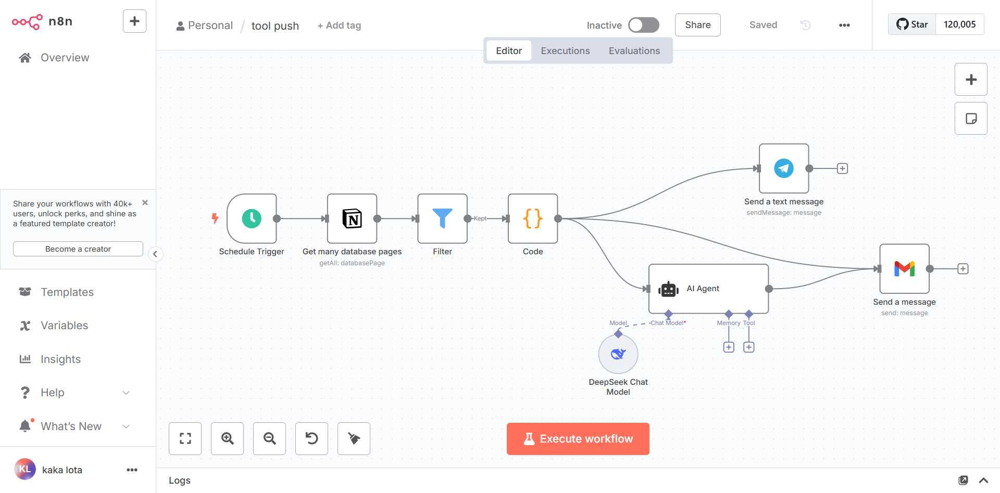
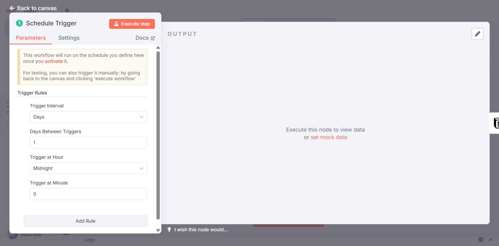
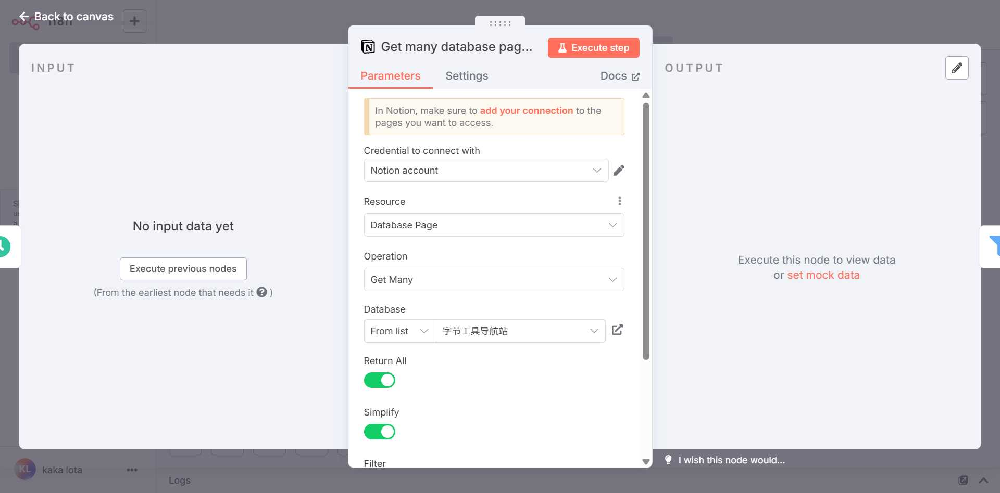
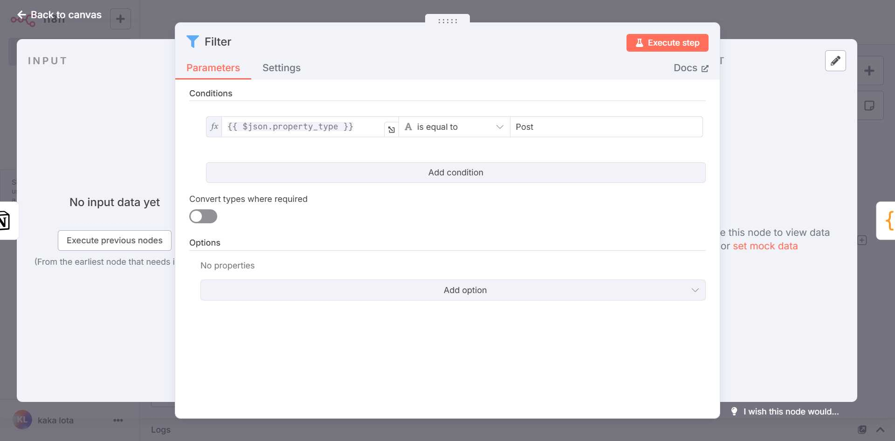
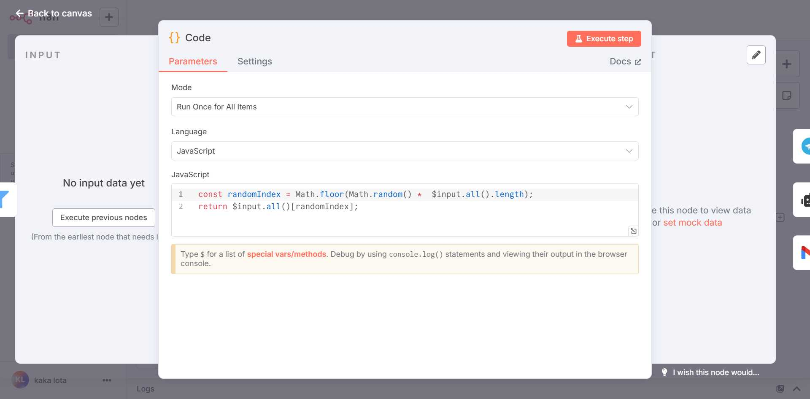
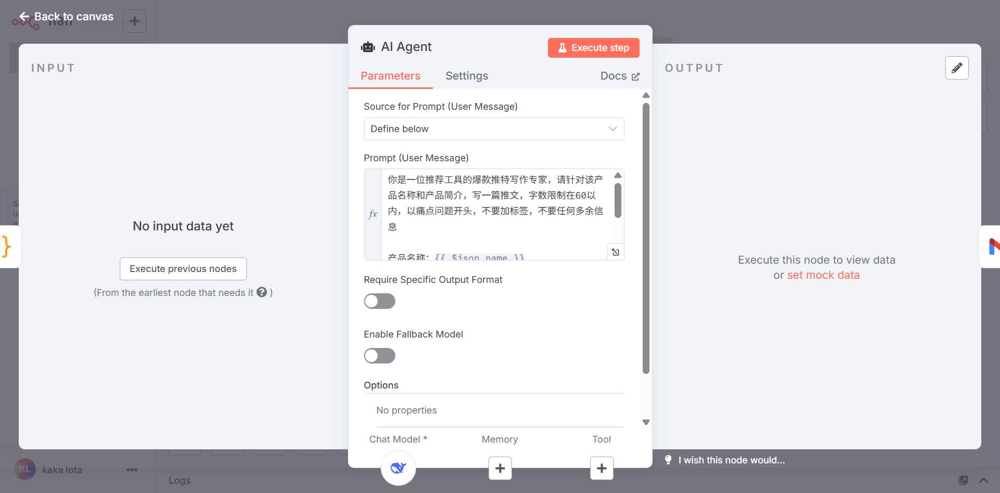
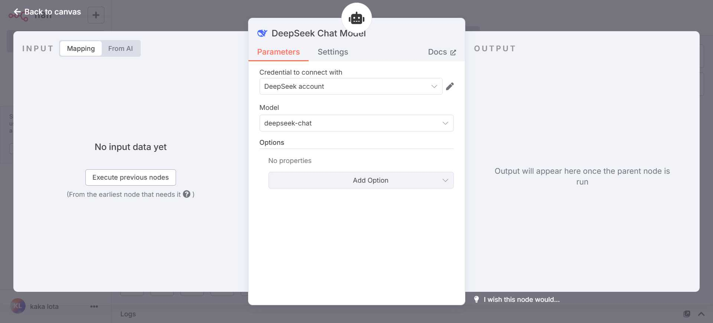
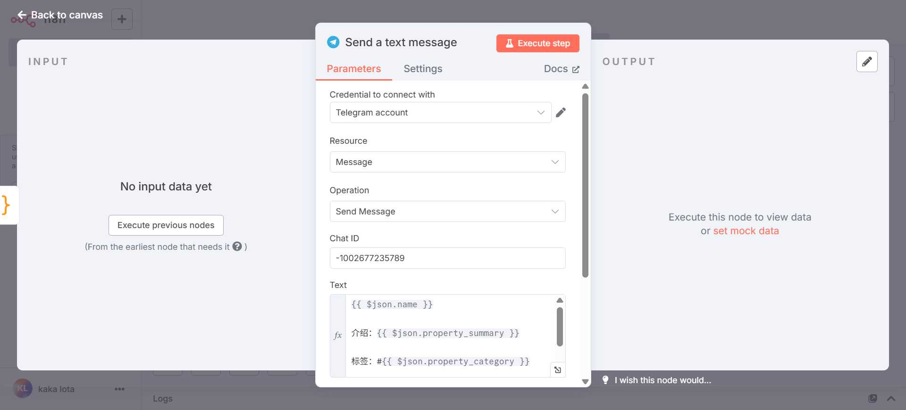
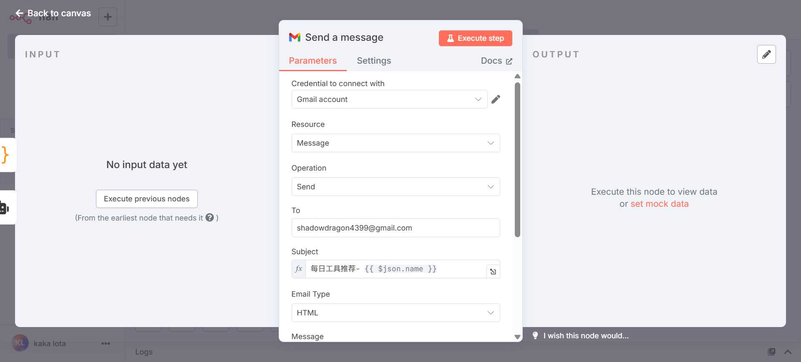

# 我用 n8n 搭了个「智能工具推荐系统」，自动筛选+AI 生成+多渠道分发，每日定时推送

## 还在手动推荐工具？你 out 了！

如果你是内容创作者，最大的难题往往是持续不断地寻找优质工具进行推荐，并将其制作成吸引人的内容，分发到各个平台。
而如果你是产品经理或开发者，需要定期向团队或用户推荐有价值的工具，但手动筛选和推送既耗时又容易遗漏。
这些困境，都源于缺乏智能化的工具管理与内容分发流程。

## 一键筛选，AI 生成，自动分发，让机器成为你的专属助理

今天，仁戈就手把手带你用 n8n，从 0 到 1 搭建一个属于你自己的「智能工具推荐系统」自动化工作流。

## 解放生产力：从手动到智能的思维转变

### 你是否还在这样低效地工作？

1. **手动筛选，效率低下**: 需要人工从大量工具中筛选出适合推荐的内容，耗时耗力。
2. **内容制作，千篇一律**: 手动编写推荐文案，缺乏创意和个性化。
3. **分发困难，覆盖有限**: 需要逐个平台手动发布，容易遗漏重要渠道。
4. **时间固定，难以坚持**: 缺乏定时机制，推荐频率不稳定。
   痛点总结：**低效、单调、分散、不稳定**

### 用 AI 工作流，重塑你的内容推荐流程

通过 n8n 搭建的 AI 工作流，我们可以实现以下七步自动化：

1. **定时触发**: 每日自动启动工作流
2. **智能筛选**: 从 Notion 数据库自动获取并过滤工具
3. **随机推荐**: 智能选择当日推荐工具
4. **AI 生成**: 自动生成个性化推文内容
5. **多渠道分发**: 同时推送到 Telegram 和邮件
6. **内容优化**: AI 优化推文吸引力
7. **效果追踪**: 自动记录推送效果



## 手把手教你搭建「智能工具推荐系统」

### 阶段一：建立定时触发机制

- **目标**：创建每日自动执行的定时器
- **节点**：Schedule Trigger
- **配置**：
  - **触发间隔**: 每天（Days）
  - **触发时间**: 午夜（Midnight）
  - **触发分钟**: 0 分钟
- **效果**：每天自动启动工作流，无需人工干预
- **截图**：
  

### 阶段二：连接你的工具数据库

- **目标**：从 Notion 数据库获取所有工具信息
- **节点**：Get many database pages (Notion)
- **配置**：
  - **资源类型**: Database Page
  - **操作**: Get Many
  - **数据库**: 字节工具导航站
  - **返回所有**: 开启
  - **简化输出**: 开启
- **效果**：获取 Notion 数据库中的所有工具记录
- **截图**：
  

### 阶段三：智能筛选推荐工具

- **目标**：过滤出适合推荐的工具（type 为 Post 的记录）
- **节点**：Filter
- **配置**：
  - **条件**: `{{ $json.property_type }}` 等于 "Post"
  - **操作符**: equals
  - **大小写敏感**: 开启
- **效果**：只保留标记为"Post"类型的工具记录
- **截图**：
  

### 阶段四：随机选择今日推荐

- **目标**：从筛选后的工具中随机选择一个进行推荐
- **节点**：Code
- **配置**：
  - **JavaScript 代码**:
  ```javascript
  const randomIndex = Math.floor(Math.random() * $input.all().length)
  return $input.all()[randomIndex]
  ```
- **效果**：随机选择一个工具，确保推荐内容的多样性
- **截图**：
  

### 阶段五：AI 生成个性化推文

- **目标**：使用 AI 根据工具信息生成吸引人的推文
- **节点**：AI Agent
- **配置**：

  - **提示词**:

  ```
  你是一位推荐工具的爆款推特写作专家，请针对该产品名称和产品简介，写一篇推文，字数限制在60以内，以痛点问题开头，不要加标签，不要任何多余信息

  产品名称：{{ $json.name }}
  产品信息：{{ $json.property_summary }}
  ```

- **效果**：AI 自动生成个性化、有吸引力的推文内容
- **截图**：
  

### 阶段六：选择强大的 AI 大脑

- **目标**：为 AI Agent 提供强大的语言模型支持
- **节点**：DeepSeek Chat Model
- **配置**：
  - **模型**: deepseek-chat
  - **凭据**: DeepSeek API 密钥
- **效果**：提供高质量的 AI 文本生成能力
- **截图**：
  

### 阶段七：推送到 Telegram 频道

- **目标**：将推荐内容自动发送到 Telegram 频道
- **节点**：Send a text message (Telegram)
- **配置**：

  - **聊天 ID**: -1002677235789
  - **消息内容**:

  ```
  {{ $json.name }}

  介绍：{{ $json.property_summary }}

  标签：#{{ $json.property_category }}

  链接：https://tool.directory.cab/article/{{ $json.property_slug }}
  ```

- **效果**：自动推送到 Telegram 频道，触达目标用户
- **截图**：
  

### 阶段八：同步发送邮件通知

- **目标**：通过邮件渠道扩大推荐覆盖面
- **节点**：Send a message (Gmail)
- **配置**：

  - **收件人**: shadowdragon4399@gmail.com
  - **主题**: `每日工具推荐- {{ $json.name }}`
  - **邮件内容**:

  ```html
  #每日工具推荐<br /><br />

  {{ $('AI Agent').first().json.output }}<br /><br />

  工具链接见评论区<br /><br />

  工具链接：<a href="https://tool.directory.cab/article/{{ $json.property_slug }}">https://tool.directory.cab/article/{{ $json.property_slug }}</a><br /><br />
  ```

- **效果**：通过邮件渠道进一步扩大推荐影响力
- **截图**：
  

---

我是仁戈，关注我，一起成长。

如果你觉得这篇文章对你有帮助，别忘了点赞+收藏+转发哦～
